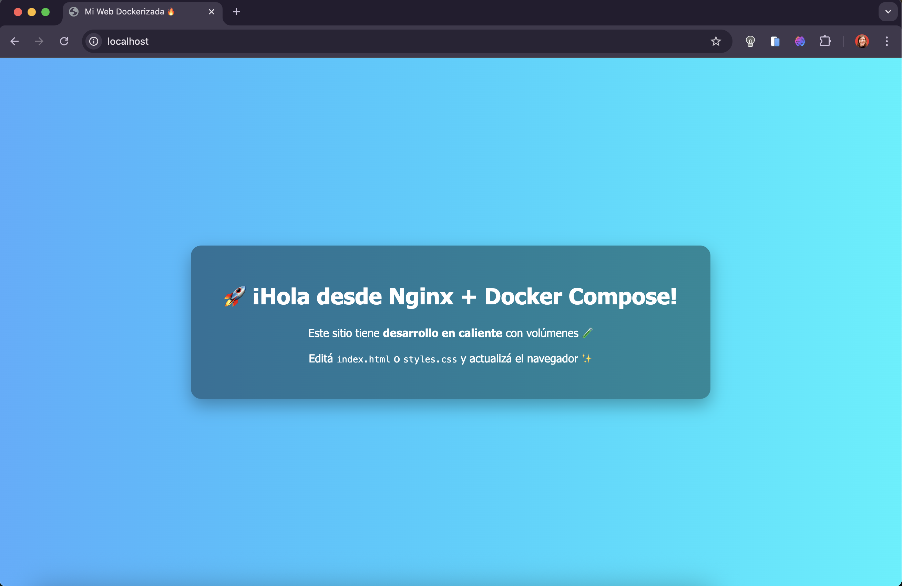

# 🚀 Web Estática con Docker, Nginx y Hot Reload

Este proyecto sirve una página web estática con **Nginx** usando **Docker** y **Docker Compose**, con soporte para **desarrollo en caliente** 🔥. Está pensado para ser simple, rápido de levantar y visualmente atractivo.

---

## 📦 Características

✅ Servidor web Nginx en contenedor  
✅ HTML + CSS con estilo profesional  
✅ Desarrollo en caliente (hot reload) vía volúmenes  
✅ Docker Compose para levantar todo con un solo comando  
✅ Diseño responsive y moderno con CSS  
✅ Preparado para escalar a producción o HTTPS

---

## 📁 Estructura del Proyecto

static-website/
├── docker-compose.yml
├── Dockerfile
├── nginx/
│ └── default.conf
├── html/
│ ├── index.html
│ └── styles.css
├── README.md


---

## 🧪 Requisitos

- Docker Desktop (macOS, Windows o Linux)
- Terminal con acceso a `docker` y `docker compose`
- Editor de código (recomendado: VS Code, Cursor)

---

## ⚙️ Cómo correr el proyecto

1. Cloná este repositorio o descargalo:
    ```bash
    git clone https://github.com/tuusuario/static-website.git
    cd static-website
    ```

2. Levantá el entorno:
    ```bash
    docker compose up --build
    ```

3. Abrí tu navegador en:  
   👉 [http://localhost](http://localhost)

---

## 🧠 Desarrollo en Caliente

Cualquier cambio que hagas en:

- `html/index.html`
- `html/styles.css`

Se reflejará automáticamente al refrescar el navegador.  
¡No necesitás reconstruir el contenedor! ✨

---

## 🌈 Vista previa



---

## 📌 Tips

- Si querés agregar JS, simplemente agregá un archivo y enlazalo en el HTML.
- El volumen está en modo `ro` (read-only) para proteger el contenedor.
- Podés cambiar el puerto fácilmente editando el `docker-compose.yml`.

---

## 🛑 Cómo detener

```bash
docker compose down

📄 Licencia
MIT - Libre para modificar, usar y compartir.
Desarrollado con ❤️ por yesgallo

